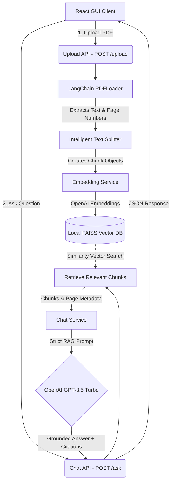

# Nexus RAG Chatbot

## Overview
Nexus RAG is an intelligent, full-stack Document Analysis Chatbot designed to process PDF documents and provide highly accurate answers to user queries based strictly on the uploaded content. By leveraging a Retrieval-Augmented Generation (RAG) pipeline, it prevents AI hallucination and cites the exact source page numbers of the document for its answers.

## Architecture Diagram



## Tech Stack
### Frontend
- **React.js** (Bootstrapped with Vite)
- **Vanilla CSS** (Custom Premium Glassmorphism UI)
- **Lucide React** (Vector Icons)

### Backend
- **Node.js & Express** (API Server)
- **Multer** (File Upload Handling)
- **LangChain Ecosystem** (`@langchain/community`, `@langchain/openai`, `@langchain/core`)
- **FAISS Node** (Local Vector Database Storage)
- **OpenAI API** (Embeddings & Chat Inference)

## Features
- **Intelligent RAG Pipeline**: Upload any PDF and query its contents instantly.
- **Accurate Source Citations**: The AI tracks page metadata and appends the exact source page numbers (e.g., `Source: Page 3`) to its answers.
- **Hallucination Prevention**: Strict zero-temperature prompting forces the model to respond only using the retrieved context, returning "I don't know" if the answer isn't in the document.
- **Beautiful Glassmorphism UI**: A dark-mode, premium chat interface featuring dynamic loading states, bouncing typing indicators, and smooth micro-animations.
- **Local Vector Storage**: Embeddings are efficiently stored and retrieved locally on your machine using Facebook's FAISS library.

## How to Run

### Prerequisites
1. Ensure you have **Node.js** installed on your machine.
2. Obtain an **OpenAI API Key** from your OpenAI developer account.

### 1. Backend Setup
Navigate to the `server` directory and install the required packages:
```bash
cd server
npm install
```
Create a `.env` file in the `server` root directory and add your API key:
```env
OPENAI_API_KEY=your_openai_api_key_here
```
Start the backend server:
```bash
npm start
```
*The server will start running on `http://localhost:5000`.*

### 2. Frontend Setup
Open a new terminal window, navigate to the `client` directory, and install the frontend dependencies:
```bash
cd client
npm install
```
Start the Vite development server:
```bash
npm run dev
```
*The React app will be accessible at `http://localhost:5173`. Open it in your browser to begin analyzing documents!*

## Screenshots
> Modify the image links below to add screenshots of your running application.

| Main Chat Interface | File Uploading & Processing |
| :---: | :---: |
| ** | ** |
